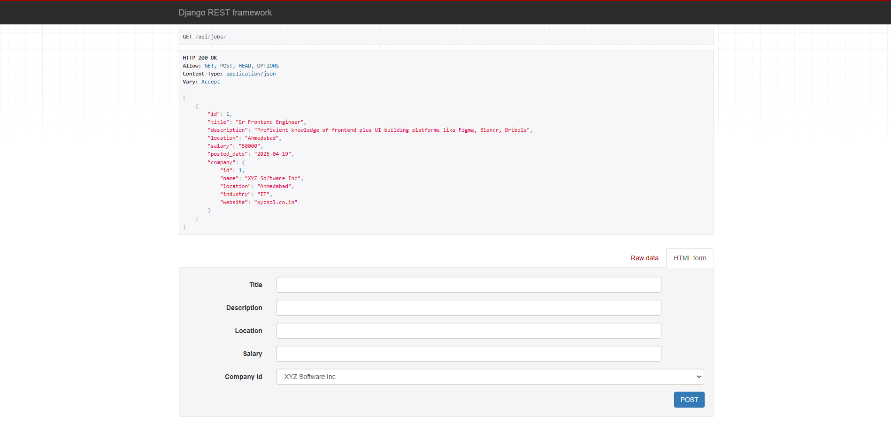
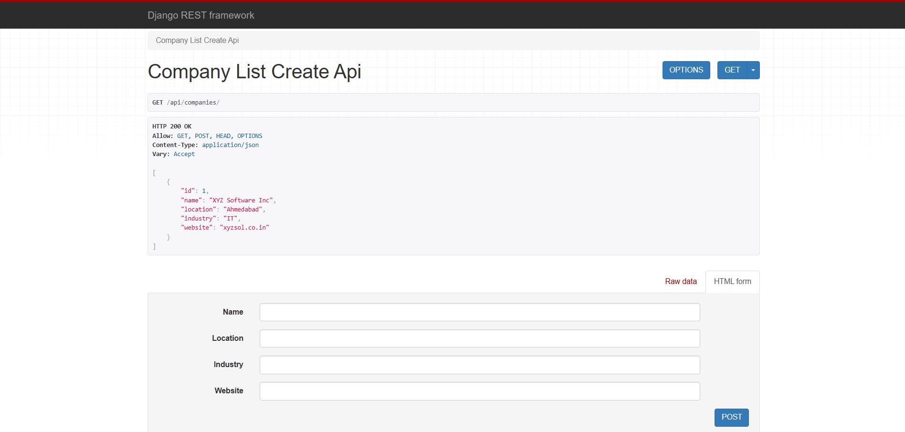

# 🚀 RESTfulAPI-Django – Job Listings App

A modern and responsive **Job Listings Application** built with Django and Django REST Framework. It features a RESTful backend and a stunning Bootstrap-powered frontend to display job postings effectively.

---

## ✨ Features

- 📄 Create, Read, Update, Delete (CRUD) Jobs
- 🔍 Job Detail View
- 🗂️ Organized template structure
- ⚡ Responsive design for mobile & desktop
- 🔁 REST API ready (extendable with DRF)

---

## 🖼️ UI Screenshots

| Job List Page | Company List Page |
|---------------|-----------------|
|  |  |


---

## 🛠️ Tech Stack

- **Backend**: Django 4+, Django REST Framework
- **Database**: SQLite3 (default), can switch to PostgreSQL/MySQL

---

## 🚦 How to Run the Project

1. Clone the repo

```bash
git clone https://github.com/rahull0328/RESTfulAPI-Django.git
cd RESTfulAPI-Django
```

2. Create a virtual environment

```bash
python -m venv env
source env/bin/activate  # On Windows: env\Scripts\activate
```

3. Run migrations

```bash
python manage.py makemigrations
python manage.py migrate
```

4. Run the development server

```bash
python manage.py runserver
```

5. Visit http://127.0.0.1:8000/ to view the job portal!

---

##  🧪 Test Your API

#### Use Postman, or visit these URLs in the browser:

- GET /api/companies/ → List companies

- POST /api/companies/ → Create company

- GET /api/companies/1/ → Retrieve a company

- PUT /api/companies/1/ → Update a company

- GET /api/jobs/ → List all jobs

- POST /api/jobs/ → Create a job

- GET /api/jobs/?company=1 → Filter jobs by company

- GET /api/jobs/1/ → Job detail